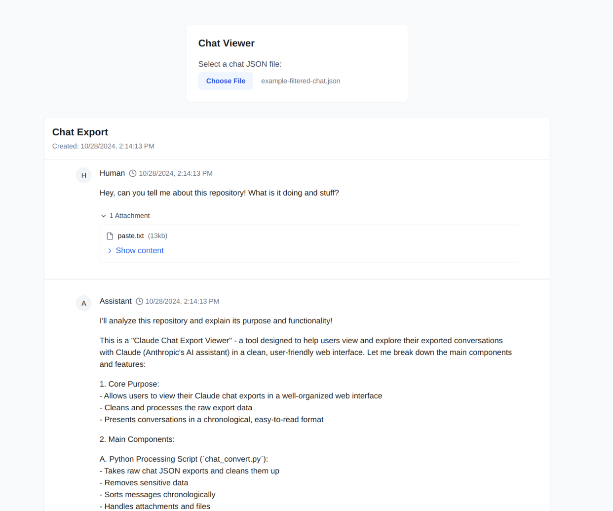

# Claude Chat Export Viewer

A tool for exploring and viewing Claude AI chat exports. This project provides utilities to extract, process, and view conversations from Claude chat exports in a clean web interface.

## Features

- Extract individual conversations from Claude export files
- Clean and normalize conversation data
- View conversations in a user-friendly web interface
- Support for attachments and file content
- Chronological message ordering

## Prerequisites

- Node.js and npm/bun
- Python 3.x
- jq (command-line JSON processor)
- Claude chat export file (conversations.json)

## Installation

1. Clone this repository:
```bash
git clone https://github.com/AdjectiveAllison/claude-chat-viewer.git
cd claude-chat-viewer
```

2. Install dependencies:
```bash
bun install  # or npm install
```

## Usage

### 1. Exploring Available Conversations

First, explore your conversations.json file to find the chat you want to view:

```bash
# List all conversation names and their indices
jq -r 'to_entries | .[] | "\(.key): \(.value.name)"' conversations.json

# Search conversations by name
jq -r 'to_entries | .[] | select(.value.name | contains("specific text")) | "\(.key): \(.value.name)"' conversations.json

# Get details about a specific conversation
jq '.[123].name' conversations.json  # Replace 123 with the conversation index
```

### 2. Extracting a Conversation

Once you've identified the conversation you want to view:

```bash
# Extract conversation by index (replace 123 with your desired conversation index)
jq '.[123]' conversations.json > export_chat.json
```

### 3. Processing the Conversation

Use the conversion script to clean and format the conversation data:

```bash
python3 chat_convert.py export_chat.json chat_filtered.json
```

This script:
- Sorts messages chronologically
- Removes sensitive data
- Normalizes the format
- Processes attachments

### 4. Viewing the Conversation

Start the web interface:

```bash
bun run dev  # or npm run dev
```

Open [http://localhost:3000](http://localhost:3000) in your browser and upload your processed chat_filtered.json file.

### Example Usage

1. Export your chat data from Claude's web interface by going to Profile > Account > Export Data:


2. Process your exported conversations using the Python script as described above.

3. Upload the processed JSON file to the web viewer:


An example of a processed chat file is included in the repository as `example-filtered-chat.json` for reference.

## Web Interface Features

- Clean, threaded conversation view
- Timestamp display
- Expandable attachments
- Code highlighting
- Responsive design

## Development

This is a [Next.js](https://nextjs.org) project with TypeScript. Key files:

- `chat_convert.py`: Conversation processing script
- `components/ChatViewer.tsx`: Main conversation display component
- `app/page.tsx`: File upload and main page component

## Contributing

Contributions are welcome! Please feel free to submit a Pull Request.

## License

[MIT]


## TODOs

- Actually add the MIT license properly instead of just saying "\[MIT\]"
- Does it actually highlight code? I sorta doubt it. Make visualization better.
